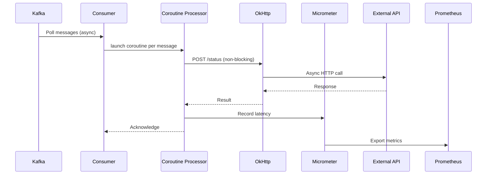

# Async Integrator with Kotlin Coroutines 🚀

Projeto demonstrativo de integração assíncrona utilizando **Kotlin Coroutines** e **Spring Boot**, focado em resolver problemas de latência em sistemas distribuídos.

## Objetivo 🎯
Demonstrar como as corrotinas do Kotlin podem ser utilizadas para:
- Reduzir a complexidade de operações assíncronas
- Melhorar o throughput em sistemas de alta concorrência
- Minimizar a latência em chamadas de rede
- Integrar eficientemente diferentes tecnologias (Kafka, HTTP APIs, Monitoramento)

## Arquitetura 🏗️

### Componentes Principais:
1. **Kafka Consumer** (Spring Kafka)
    - Consumo assíncrono de mensagens de status
    - Processamento em lote não-bloqueante

2**HTTP Client** (OkHttp + Coroutines)
    - Chamadas de rede não-bloqueantes
    - Timeouts configuráveis

3. **Monitoring** (Micrometer + Prometheus)
    - Métricas de desempenho em tempo real
    - Monitoramento de latência e throughput

### Fluxo Principal:
