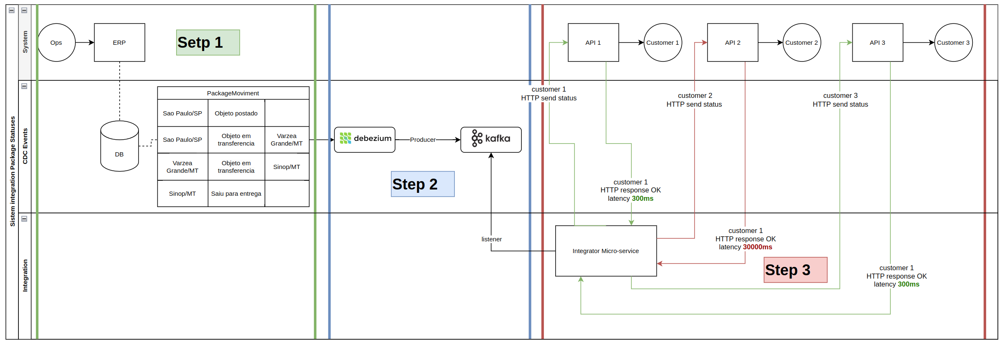
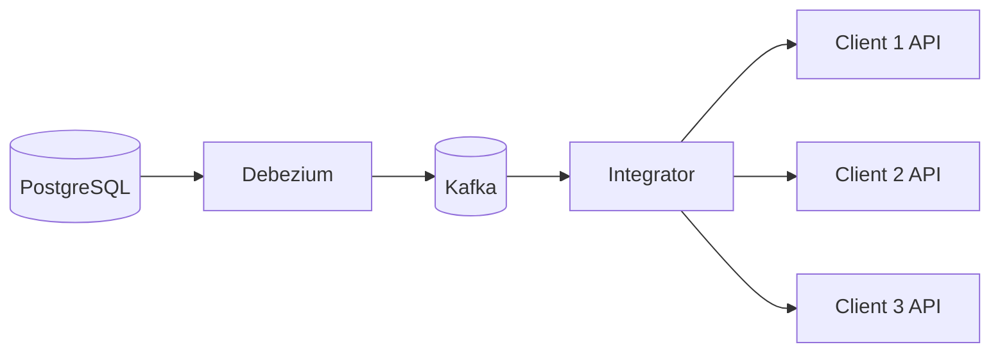
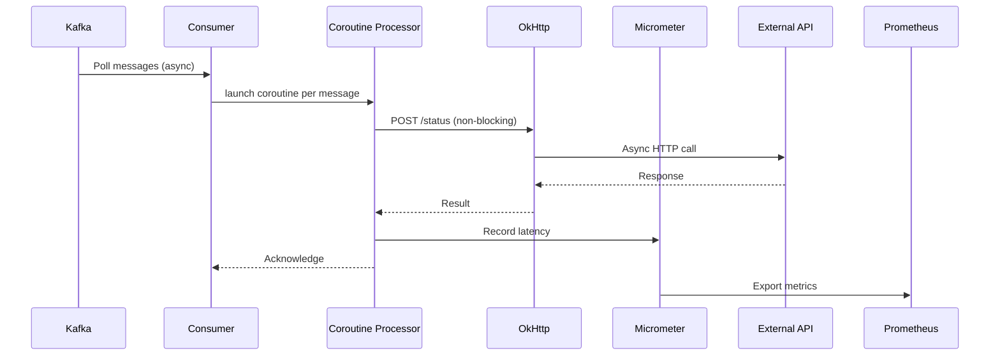

# Async Integrator with Kotlin Coroutines 🚀

Projeto demonstrativo de integração assíncrona utilizando **Kotlin Coroutines** e **Spring Boot**, focado em resolver problemas de latência em sistemas distribuídos.


## Objetivo do projeto Integrator 🎯
Demonstrar como as corrotinas do Kotlin podem ser utilizadas para:
- Reduzir a complexidade de operações assíncronas
- Melhorar o throughput em sistemas de alta concorrência
- Minimizar a latência em chamadas de rede
- Integrar eficientemente diferentes tecnologias (Kafka, HTTP APIs, Monitoramento)

## Integração com o CDC (Change Data Capture) Producer 🔗
Este projeto (**Integrator**) é a **PARTE 2** do artigo técnico publicado no Medium:  
[**Coroutines: Performance de aplicações em cenários críticos de latência**](https://medium.com/@devsergioramos/coroutines-performance-de-aplica%C3%A7%C3%B5es-em-cen%C3%A1rios-cr%C3%ADticos-de-lat%C3%AAncia-uma-abordagem-pr%C3%A1tica-com-1ba5ff21cd9f)

### Contexto Completo da Solução
**PARTE 1 - CDC Producer** ([Repositório GitHub](https://github.com/devsergioramos/cdc-event-driven-architecture-producer)):
- Implementação de um pipeline de dados usando:
    - PostgreSQL + Debezium para Change Data Capture
    - Kafka para streaming de eventos em tempo real
    - Script Python para geração massiva de dados (10k+ eventos/sec)

**PARTE 2 - Integrator** (Este projeto)

## Arquitetura Geral 🏗️


**Diagrama estrutural PARTE 1 + PARTE 2**:


## Links úteis 🔗 
* Repositório CDC Producer
* Artigo Medium: Coroutines na Prática

## Projeto Integrator

### Componentes Principais:
1. **Kafka Consumer** (Spring Kafka)
    - Consumo assíncrono de mensagens de status
    - Processamento em lote não-bloqueante

2. **HTTP Client** (OkHttp + Coroutines)
    - Chamadas de rede não-bloqueantes
    - Timeouts configuráveis

3. **Monitoring** (Micrometer + Prometheus)
    - Métricas de desempenho em tempo real
    - Monitoramento de latência e throughput

### Fluxo Principal:


## Tecnologias Utilizadas 💻

| Tecnologia           | Versão    | Finalidade                              |
|----------------------|-----------|-----------------------------------------|
| Kotlin               | 1.9.25    | Linguagem principal com corrotinas      |
| Spring Boot          | 3.4.2     | Framework base                          |
| Kafka (Spring)       | 3.4.x     | Mensageria assíncrona                   |
| OkHttp               | 4.12.0    | Cliente HTTP não-bloqueante             |
| Micrometer           | 1.12.x    | Monitoramento de métricas               |
| JUnit 5              | 5.9.3     | Testes unitários e integração           |

## Como Funciona? ⚙️

### Princípios Chave

**1. Suspensão Seletiva**
```kotlin
suspend fun sendStatus(endpoint: ClientEndpoint, json: String): NetworkResult<String> {
    return withContext(Dispatchers.IO) {
        // Operação de I/O não-bloqueante
    }
}
```

**2. Paralelismo Controlado**  
```kotlin
val results = listOf(asyncTasks).awaitAll()
```

**3. Resiliência**
```kotlin
try {
    // Tentativa principal
} catch (e: IOException) {
    // Fallback estratégico
}
```

## Métricas Chave 📊

| Métrica                      | Tipo      | Descrição                              |
|------------------------------|-----------|----------------------------------------|
| `service.message.latency`    | Timer     | Latência total desde consumo até confirmação |
| `service.message.throughput` | Counter   | Volume de mensagens processadas por minuto |
| `service.message.error`      | Counter   | Falhas em chamadas HTTP para APIs externas |
| `kafka.consumer.lag`         | Gauge     | Atraso na leitura das mensagens do Kafka |

## Contribuição 🤝

1. **Faça um Fork do Repositório**  
   [Clique aqui](https://github.com/seu-usuario/integrator/fork) para criar seu fork

2. **Crie uma Branch para sua Feature**
   ```bash
   git checkout -b feature/nova-funcionalidade
    ```
3. **Commits Semânticos**
Utilize o padrão de commits semânticos para manter o histórico organizado
```bash
git commit -m "feat: adiciona processamento em lote" 
git commit -m "fix: corrige timeout nas chamadas HTTP"
```
4. **Sincronize com Upstream**
```bash
git pull upstream main
```
5. **Envie seu Pull Request**
    Descreva claramente:
   * Problema resolvido
   * Mudanças implementadas
   * Impacto na performance

## Licença 📜
[](https://opensource.org/licenses/MIT)

**Mantenedor Principal**
- [devsergioramos](https://github.com/devsergioramos)

**Status do Projeto**  
 🔄  